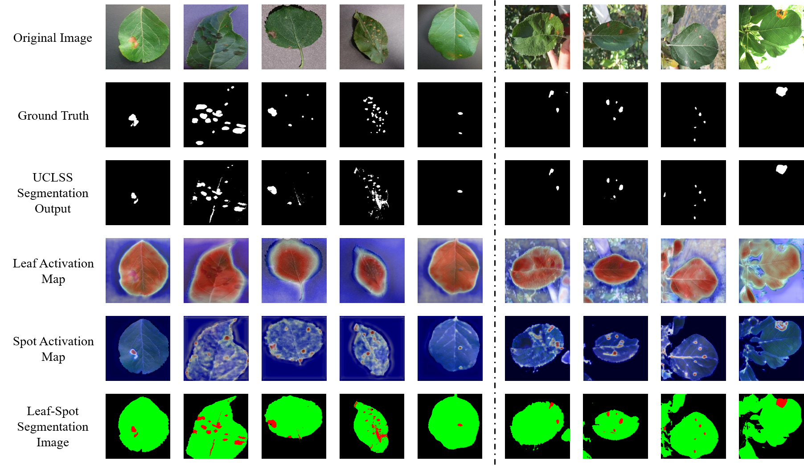

# UPLS

# UPLS: Unsupervised Prompt Learning via SAM for Leaf Disease Segmentation

# Introduction
In modern agriculture, leaf disease segmentation is crucial for crop disease management and yield improvement. As most deep learning-based segmentation models require extensive annotations, it is feasible to resort to advanced models like the Segment Anything Model (SAM) can produce precise class-agnostic masks without annotations. However, their reliance on human-interactive prompts limits their utility to unsupervised spot segmentation tasks. To address this limitation, we propose *Unsupervised Prompt Learning via SAM for Leaf Disease Segmentation* (**UPLS**), a novel three-stage framework that leverages unsupervised contrastive learning to segment foreground regions of interest and automatically generates disease prompts for SAM. In the first two stages, UPLS sequentially segments the leaf and disease areas by distinguishing foreground and background features through unsupervised contrastive learning. Specifically, for small and intricate lesions, we additionally extract fine-grained information and high-frequency features based on the segmented leaf area, and devise contrastive losses between global priors and foreground/background features to generate precise initial lesion regions. In the final stage, positive and negative prompts are derived from the segmented leaf and initial lesion regions, respectively, enabling SAM to refine disease boundaries without human intervention. Experiments on the public leaf disease dataset show that UPLS outperforms existing non-fully supervised segmentation methods in accuracy and robustness.


# Preparation

## 1. Clone the repo

```
git clone https://github.com/Tianluda/UPLS.git
cd UPLS
```

## 2. Prepare the data

Download [the Apple Leaf Disease Dataset and the Extra test dataset](https://data.mendeley.com/datasets/tsfxgsp3z6/2) used in this paper. After downloading, place the datasets under the "./experiments/data" folder.


## 3. Environment setting

Follow [CCAM](https://github.com/CVI-SZU/CCAM) to build the environment.

The dependencies are configured as follows:

* Python 3
* PyTorch 1.12.1
* OpenCV-Python
* Numpy
* Scipy
* MatplotLib
* Yaml
* Easydict

## 4. Pretrained Parameters

Download the following pretrained parameters and place them in the current directory.
'mocov2': [here](https://drive.google.com/drive/folders/1erzARKq9g02-3pUGhY6-hyGzD-hoty5b?usp=sharing)
'detco': [here](https://drive.google.com/drive/folders/1erzARKq9g02-3pUGhY6-hyGzD-hoty5b?usp=sharing)
'Plant': [here](https://zenodo.org/records/7890438/files/ResNet50-Plant-model-80.pth?download=1)

```
├── UPLS/
|   ├── core
|   ├—— ...
|   ├—— moco_r50_v2-e3b0c442.pth
|   └── detco_200ep.pth
|   └── ResNet50-Plant-model-80.pth
```

## 5. Training and inference

### Stage 1: Leaf Structure Segmentation

First, train the UPLS-1 model with MOCO pretrained weights to extract the leaf foreground area.

```
nohup /bin/bash ./start_MOCO.sh >> ./cron_MOCO.log 2>&1
```

The code will create experiment folders for model checkpoints (./experiment/models), log files (.experiments/logs), visualization (./experiments/images/) and prediction results (./experiments/predictions/).

```
├── experiments/
|   ├—— images
|   ├—— logs
|   ├—— models
|   ├── predictions
```

The above code has generated a binary map of the leaf area. Next, use the first part of the code in './Process-Evaluation.ipynb' to generate the leaf foreground area (RGBA four-channel image).

### Stage 2: Disease Spot Segmentation

In the second step, use the UCLSS-2 model with DETCO or Plant pretrained weights to extract the initial disease spot foreground area.

```
nohup /bin/bash ./start_DETCO.sh >> ./cron_DETCO.log 2>&1
```

```
nohup /bin/bash ./start_Plant.sh >> ./cron_Plant.log 2>&1
```

### Stage 3: Prompt-Guided Segmentation Refnement

Next, use the Prompt-Guided Segmentation Refinement method based on SAM to refine the disease spot area.
Copy the scripts in './segment-anything-main/notebooks' to the corresponding directory in the [SAM](https://github.com/facebookresearch/segment-anything) source code, and execute the following command:

```
nohup ./segment-anything-main/notebooks/C2AM_SAM_Box.sh >> ./segment-anything-main/notebooks/C2AM_SAM_Box.log 2>&1
```

## 6. Evaluation

Use the second part of the code in './Process-Evaluation.ipynb' to evaluate the model performance on the test dataset.

## 7. Visualization



## Reference
